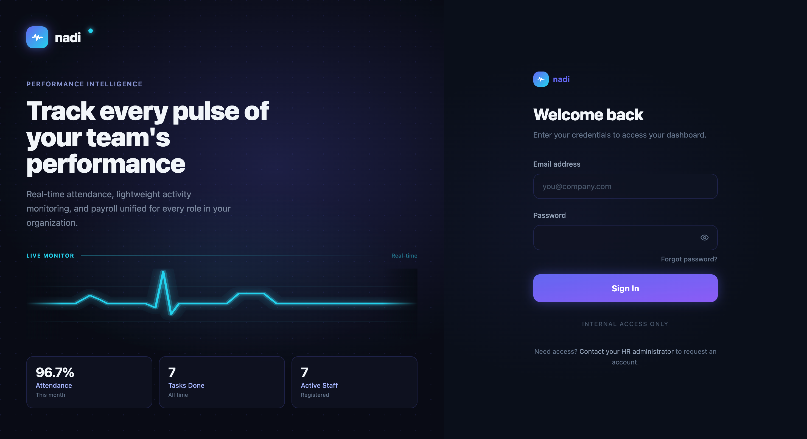
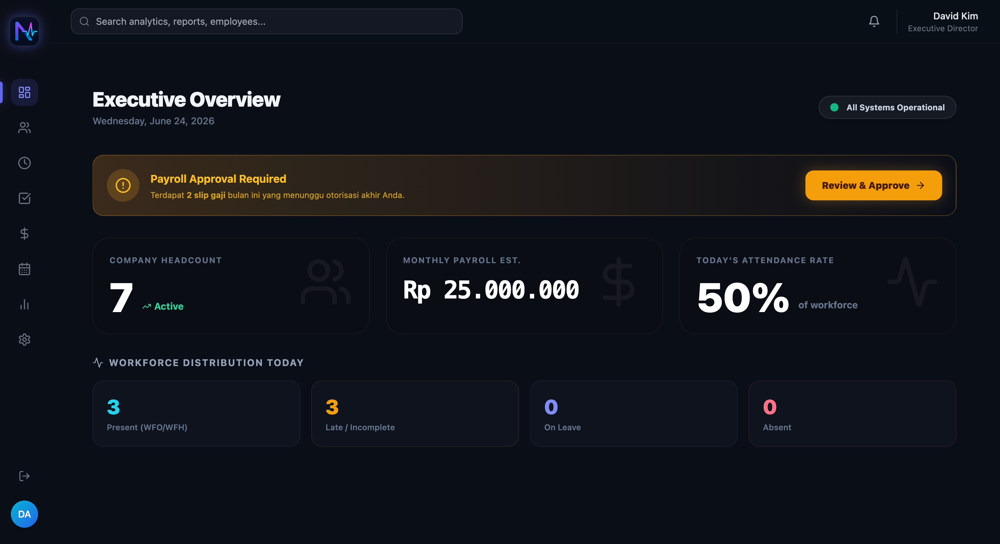

# 📈 Nadi — Performance Intelligence & HR Management System

Nadi adalah platform *Software as a Service (SaaS)* skala Enterprise yang dirancang untuk melacak kinerja tim dan sumber daya manusia secara *real-time*. Aplikasi ini menyatukan pemantauan absensi, manajemen tugas (*Kanban*), pengajuan cuti, hingga persetujuan dan perhitungan slip gaji (*Payroll*) ke dalam satu ekosistem yang terintegrasi secara mulus untuk Karyawan, HR, dan Eksekutif (Direktur).

## 📸 Screenshot

---

## ✨ Features

🔹 **Role-Based Access Control (RBAC):** Sistem otentikasi berlapis yang memisahkan hak akses dan *interface* secara total untuk 3 kubu berbeda: `EMPLOYEE`, `HR`, dan `BOSS`.
🔹 **Real-time Attendance:** Sistem *Clock-in / Clock-out* interaktif dengan perhitungan persentase kehadiran dan durasi kerja secara otomatis.
🔹 **Interactive Kanban Board:** Manajemen tugas (Tasks) menggunakan papan *drag-and-drop* yang intuitif (To Do, In Progress, Done) antar karyawan dan HR.
🔹 **Leave Management:** Alur pengajuan cuti karyawan yang mulus, lengkap dengan sistem persetujuan (*Approve/Reject*) berjenjang oleh HR dan Direktur.
🔹 **Automated Payroll System:** Mesin kalkulasi draf gaji (Gaji Pokok, Tunjangan, Potongan) yang terintegrasi dengan tombol Otorisasi Pencairan (*One-Click Approve & Transfer*) di meja Direktur.
🔹 **Executive Analytics:** *Dashboard* analitik khusus Direktur yang dilengkapi dengan grafik *Radar* dan *Area* untuk memantau metrik kesehatan perusahaan secara keseluruhan (*bird-eye view*).
🔹 **Premium UI/UX:** Antarmuka bernuansa gelap (*Dark Mode*) yang sangat elegan, responsif, modern, dan kaya akan transisi animasi (*Framer Motion*).

---

## 🧰 Tech Stack

**Frontend:** Next.js 14 (App Router), React, Tailwind CSS, Framer Motion, Recharts, Lucide Icons, Radix UI.
**Backend:** Next.js Server Actions, NextAuth.js v5 (Authentication).
**Database & ORM:** PostgreSQL, Prisma ORM.

---

## 🔑 Akun Test

Gunakan kredensial berikut untuk mencoba fungsionalitas setiap *Role* di aplikasi ini (Password untuk semua akun adalah: `password123`):

| Role | Email Login | Hak Akses Utama |
| :--- | :--- | :--- |
| **Executive (Boss)** | `boss@nadi.app` | Melihat analitik global, radar performa, & *Approve Payroll*. |
| **HR Manager** | `hr@nadi.app` | Mengelola divisi, tugas, menyetujui cuti, & draf gaji. |
| **Employee 1** | `alex@nadi.app` | Akses *Clock-In*, papan tugas pribadi, & unduh slip gaji. |
| **Employee 2** | `budi@nadi.app` | Akses *Clock-In*, papan tugas pribadi, & unduh slip gaji. |
